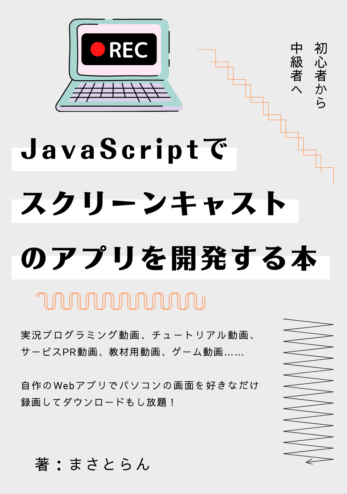

# JavaScriptでスクリーンキャストのアプリを開発する本



## 本書について

- 実況プログラミング動画
- Webサービスのチュートリアル動画
- 学習向け動画教材

本書は上記のような動画を簡単に作成できるスクリーンキャストアプリを、HTML/CSS/JavaScriptだけで自作するためのノウハウを詰め込んだ本です。

ごく普通のJavaScript（バニラJS）とWeb標準の技術を組み合わせることで、ブラウザだけで完結するスクリーンキャストのアプリを誰でも開発できるようになります。パソコンの画面を録画するだけでなく、マイクからの音声も含めることができるうえ、最終的に記録した動画ファイルをダウンロードする仕組みも学習できます。

★販売ページ：https://masatolan.booth.pm/items/3166935

## 対象読者

- HTML/CSS/JavaScriptの基本が分かる人
- 初心者から中級者にステップアップしたい人
- JavaScriptで実用的なWebアプリを作りたい人
- スクリーンキャストアプリを自作したい人

## サポートサイトについて

本書に掲載しているサンプルコードやダウンロードファイルなどをすべてまとめています。

ソースコードは独自プロジェクト、勉強会などなど…自由にご利用頂いて問題ありません。

## 最新情報・誤植

【55ページ】
ソースコードの条件分岐にて、else内のthen()末尾に;が付与されていますが本来は不要です。

```js
} else {
navigator.mediaDevices.getDisplayMedia({ video: true })
.then(videoStream => recordSetting(videoStream)); //←ここの;は不要（削除してください）
.catch(error => window.location.reload())
}
```

【56ページ】
チェックボックスの無効化・有効化における値の指定がどちらもtrueになっていました。正しくは以下のとおりです。

```js
micSwitch.disabled = true; // 無効化

micSwitch.disabled = false; // 有効化
```

【59ページ】
CSSのセレクター名が「#downloadBt」と記載していますが正しくは「#downloadBtn」になります。

```css
#downloadBtn {
    padding: 5px;
    color: #000;
    border: 4px solid #888;
    border-radius: 15px;
    text-decoration: none;
}
```

